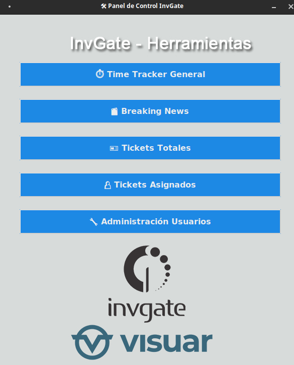
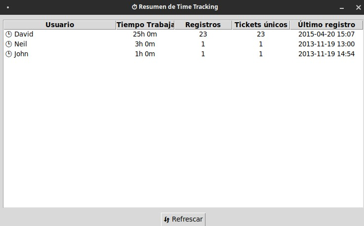
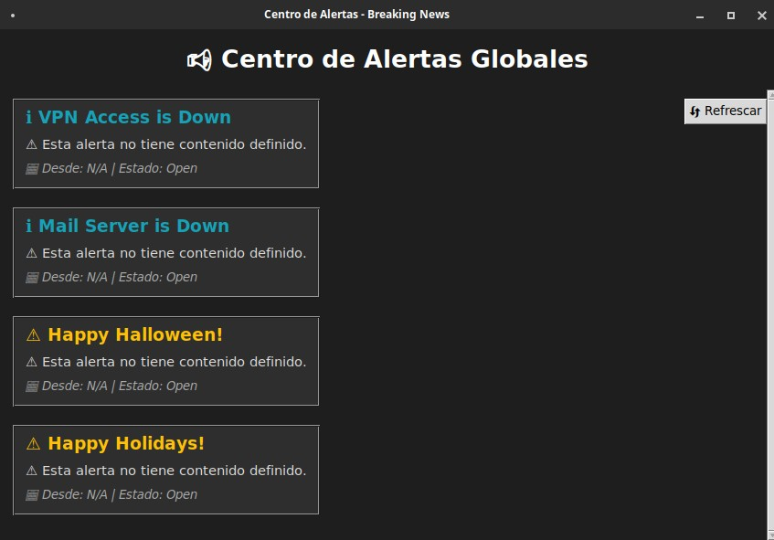
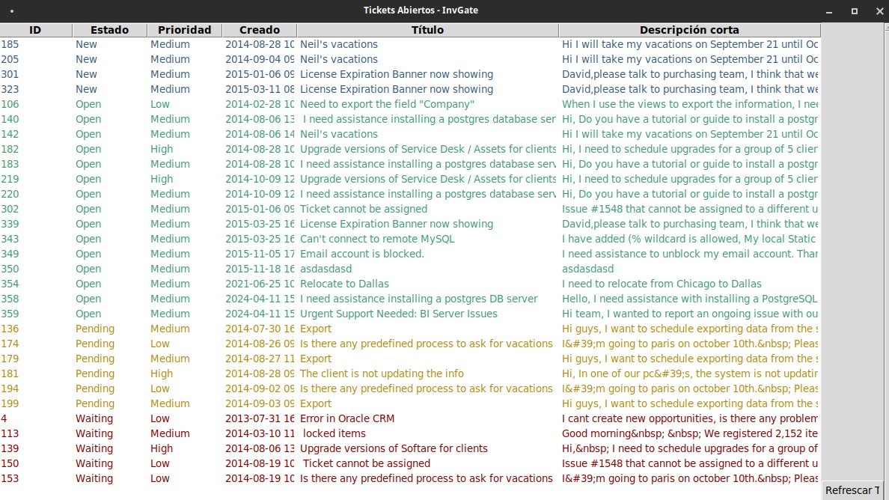
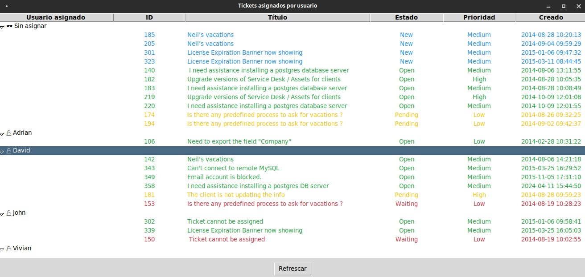
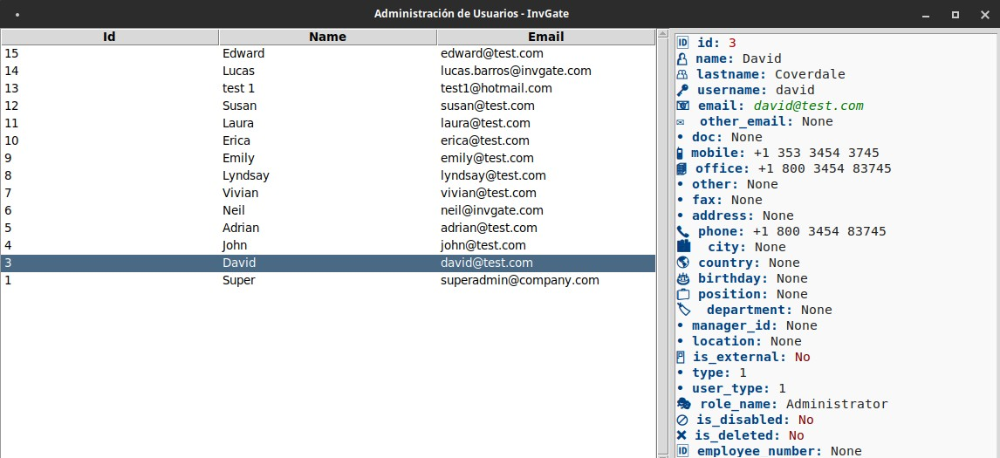

# InvGate-API-Panel

# 🎯 InvGate Toolkit - Herramientas Visuales para Mesa de Ayuda

  

Este conjunto de herramientas fue desarrollado como una solución visual y funcional para la administración de tickets, usuarios, alertas y tiempos de trabajo a través de la API de InvGate.

---

## 🧰 Funcionalidades desarrolladas

### ⏱️ Resumen de Time Tracking

Visualización por agente de:
- Tiempo total trabajado
- Cantidad de registros
- Tickets únicos donde participó
- Último registro realizado

  

---

### 📢 Centro de Alertas (Breaking News)

Muestra alertas activas con íconos, colores y fecha de inicio. Separadas por tipo (información, advertencia, crítica).

  

---

### 🧾 Todos los Tickets Abiertos

Listado por estado con título, prioridad, fecha y resumen. Permite doble clic para ver el detalle completo.

  

---

### 👥 Tickets Asignados por Usuario

Vista jerárquica con tickets agrupados por usuario. Ideal para evaluar carga de trabajo y supervisión.

  

---

### 🧑‍💼 Panel de Administración de Usuarios

Detalle visual de cada usuario de la mesa de ayuda. Información enriquecida con íconos, colores y formato enriquecido.

  

---

## 🔒 Notas

- Esta solución se desarrolló como **proyecto técnico para evaluación interna**, no está pensada como herramienta pública.
- La API utilizada pertenece al entorno demo de InvGate: `webdemo.cloud.invgate.net`.
- Todas las credenciales fueron gestionadas para uso exclusivo de prueba.

---

## 🛠 Tecnologías utilizadas

- Python 3.11+
- Tkinter (interfaz gráfica nativa)
- Requests (para la API)
- Organización modular por herramienta
- Enfoque UX minimalista

---

## 📎 Consideraciones

Este repositorio fue construido para mostrar:
- Capacidad de diseño visual con Python
- Uso e interpretación de APIs RESTful
- Organización y modularidad en proyectos reales
- Enfoque orientado a usuarios funcionales

---

> ⚠️ Este desarrollo no está destinado para publicación ni distribución. Solo tiene fines demostrativos dentro de una entrevista técnica.
